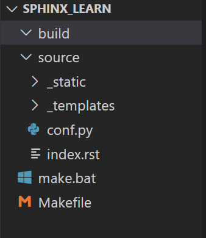
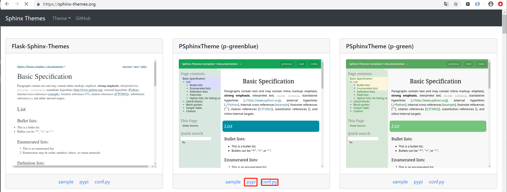
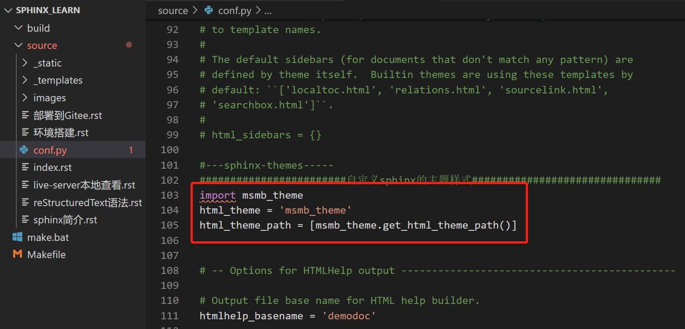
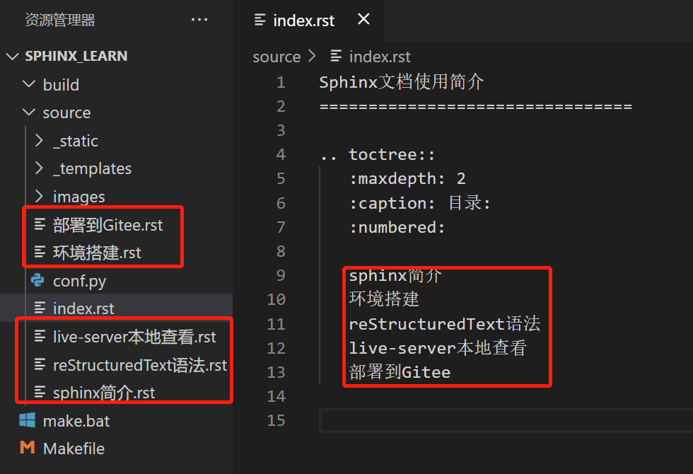
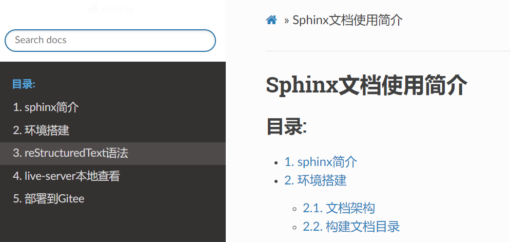

===================
环境搭建
===================
- 新建文件夹 **sphinx_learn** ,在终端下执行 `sphinx-quickstart` ,具体的选项如下
:: 

    PS E:\sphinx_learn> sphinx-quickstart
    Welcome to the Sphinx 1.8.5 quickstart utility.
    accept a default value, if one is given in brackets).

    Selected root path: .

    You have two options for placing the build directory for Sphinx output.
    "source" and "build" directories within the root path.
    > Project release []: v1.0

    If the documents are to be written in a language other than English,
    you can select a language here by its language code. Sphinx will then
    For a list of supported codes, see
    http://sphinx-doc.org/config.html#confval-language.
    > Project language [en]: zh_CN

    The file name suffix for source files. Commonly, this is either ".txt"
    or ".rst".  Only files with this suffix are considered documents.
    > Source file suffix [.rst]: 

    One document is special in that it is considered the top node of the
    "contents tree", that is, it is the root of the hierarchical structure
    of the documents. Normally, this is "index", but if your "index"
    document is a custom template, you can also set this to another filename.
    > Name of your master document (without suffix) [index]: 
    PS E:\sphinx_learn> sphinx-quickstart
    Welcome to the Sphinx 1.8.5 quickstart utility.

    accept a default value, if one is given in brackets).

    The project name will occur in several places in the built documentation.
    > Project name: demo
    > Author name(s): JefferHuang
    > Project release []: v1.0
    you can select a language here by its language code. Sphinx will then
    translate text that it generates into that language.

    For a list of supported codes, see
    http://sphinx-doc.org/config.html#confval-language.
    > Project language [en]: zh_CN

    The file name suffix for source files. Commonly, this is either ".txt"
    or ".rst".  Only files with this suffix are considered documents.
    > Source file suffix [.rst]: 

    One document is special in that it is considered the top node of the
    "contents tree", that is, it is the root of the hierarchical structure
    of the documents. Normally, this is "index", but if your "index"
    of the documents. Normally, this is "index", but if your "index"
    document is a custom template, you can also set this to another filename.
    > Name of your master document (without suffix) [index]:
    Indicate which of the following Sphinx extensions should be enabled:
    > autodoc: automatically insert docstrings from modules (y/n) [n]:
    > doctest: automatically test code snippets in doctest blocks (y/n) [n]:
    > intersphinx: link between Sphinx documentation of different projects (y/n) [n]:
    > todo: write "todo" entries that can be shown or hidden on build (y/n) [n]:
    > coverage: checks for documentation coverage (y/n) [n]:
    > imgmath: include math, rendered as PNG or SVG images (y/n) [n]:
    > mathjax: include math, rendered in the browser by MathJax (y/n) [n]:
    > ifconfig: conditional inclusion of content based on config values (y/n) [n]:
    > viewcode: include links to the source code of documented Python objects (y/n) [n]:
    > githubpages: create .nojekyll file to publish the document on GitHub pages (y/n) [n]:

    A Makefile and a Windows command file can be generated for you so that you
    only have to run e.g. `make html' instead of invoking sphinx-build
    directly.
    > Create Makefile? (y/n) [y]: y
    > Create Windows command file? (y/n) [y]: y

    Creating file .\source\conf.py.
    Creating file .\source\index.rst.
    Creating file .\Makefile.
    Creating file .\make.bat.

    Finished: An initial directory structure has been created.

    You should now populate your master file .\source\index.rst and create other documentation
    source files. Use the Makefile to build the docs, like so:
    make builder
    where "builder" is one of the supported builders, e.g. html, latex or linkcheck.

文档结构
=============
上述命令执行成功后,生成如下文档结构:
- config.py是配置文件,可自行设置
- index.rst是首页
- 其他模板和静态目录不用动,只需修改config.py和index.rst，再添加其他文件即可

构建文档目录
==============
- 在https://sphinx-themes.org/这个目录下,选择自己想要的主题，点击PyPi进入后复制命令安装，参照config或者sample修改当前目录下的 config.py

- 修改config.py文件,配置主题。

- 根据自己的需求，设计文档目录结构。

显示效果
==========
执行如下命令,生成html文件。

- make clean

- make html

